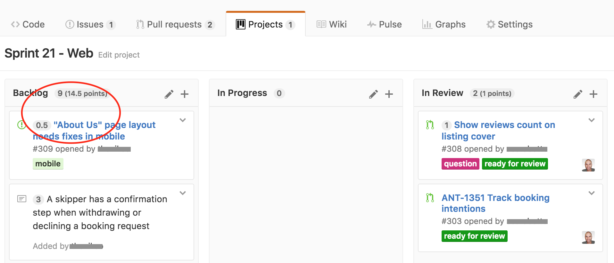

# GitHub Projects Story Points

A Chrome Extension to add [SCRUM](https://en.wikipedia.org/wiki/Scrum_(software_development))
[story points](https://en.wikipedia.org/wiki/Planning_poker) pretty display to
[GitHub Projects](https://help.github.com/articles/about-projects/).

You notes/PR/issues should have a title like `(2) My issue title` and the "(2)"
will be converted in a nice tag. Also all projects lists will have the total count
of story points in them next to the count of cards. That's it.
